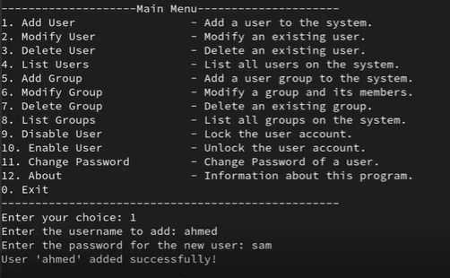

# 🐧 Python Linux User & Group Management Tool

This is a simple interactive Python script designed to help manage users and groups on Linux systems. It's ideal for sysadmins, DevOps engineers, or anyone learning Linux administration.

---

## 📌 Project Overview

This script provides a terminal-based menu that allows you to:

- Add, modify, and delete users
- Add and delete groups
- Lock and unlock user accounts
- Change user passwords
- View user and group information — all from one place



---

## ⚙️ Features

- ✅ Add users with encrypted passwords
- ✅ Modify user password or comment
- ✅ Delete users and their home directories
- ✅ Create and delete groups
- ✅ List all users and groups
- ✅ Lock and unlock user accounts
- ✅ Change user passwords
- ✅ Simple, clear terminal menu interface

---

## 🧰 Requirements

- Linux-based OS
- Python 3
- `sudo` privileges
- `openssl` installed

---

## 🚀 How to Run

### 1. Clone the repository

```bash
git clone https://github.com/elhamhassan90/Python-Linux-project.git
cd Python-Linux-project
```


### 2. Make the script executable

```
chmod +x Python_Project.py
```

### 3. Run the script

```
sudo ./Python_Project.py
```

## 👩‍💻 Author
**Elham**  
🔧 DevOps Enthusiast | System Admin | Automation Engineer | IT Support Network Egineer   
🚀 Built locally on CentOS and Docker  
📬 GitHub: https://github.com/elhamhassan90  
🔗 LinkedIn: www.linkedin.com/in/elham-hasan-6b029433a  
---

⭐ *If you found this useful or inspiring, star the repo and con
